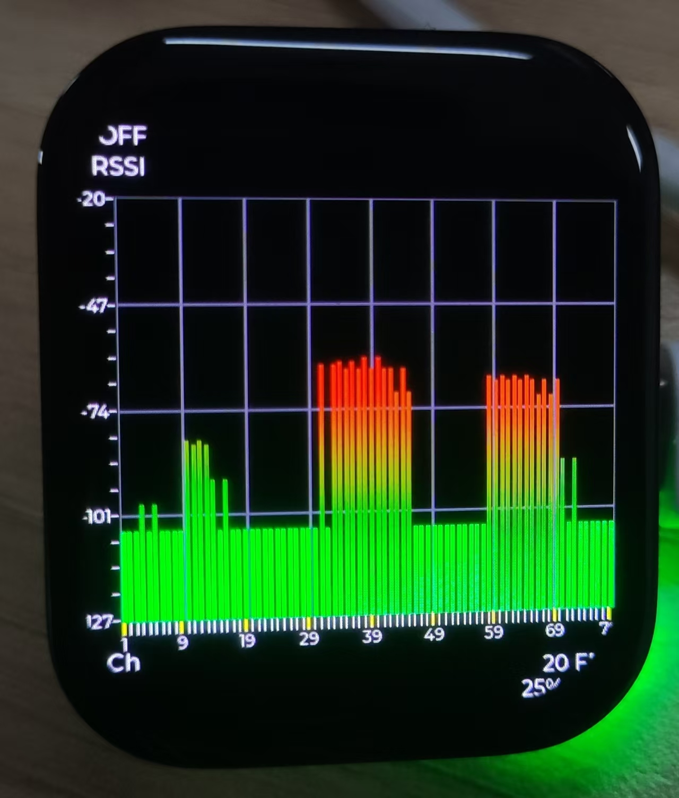

# Portable Radiation Detector

The Portable Radiation Detector is an embedded device developed based on SiFli-SDK. It acquires signal strength for each frequency point in the 2402MHz~2480MHz band through Bluetooth scanning and displays it in real-time via bar charts on the screen.

## Project Overview

This project uses the SiFli-SDK framework to implement Bluetooth signal strength detection functionality on the SF32LB52x chip. The device can scan 79 Bluetooth frequency points (0-78), display the RSSI value of each frequency point in real-time, and provide an intuitive bar chart interface through the LVGL graphics library.

## Main Features

- **Bluetooth Frequency Point Scanning**: Covers 2402MHz~2480MHz band, scanning 79 frequency points
- **Real-time Signal Strength Detection**: Updates RSSI values once per second
- **Data Storage and Playback**: Supports storing up to 10 sets of historical data, switchable via buttons
- **Bar Chart Visualization**: Implements dynamic bar chart display using LVGL library
- **Button Control**: Supports start/stop scanning and historical data browsing functions

## Technical Specifications

- **Hardware Platform**: SF32LB52x chip
- **Bluetooth Band**: 2402MHz~2480MHz
- **Number of Frequency Points**: 79 (channels 0-78)
- **RSSI Range**: -127dBm ~ -20dBm
- **Data Update Frequency**: 1Hz
- **Historical Data Storage**: Up to 10 data sets

## Project Structure

```
Radiationdetector/
├── README.md              # Project documentation
├── README_EN.md           # English version documentation
├── project/               # Project configuration files
│   ├── Kconfig           # Kernel configuration
│   ├── SConscript        # SCons build script
│   ├── SConstruct        # SCons build configuration
│   └── build_sf32lb52-lchspi-ulp_hcpu/  # Build output directory
└── src/                   # Source code directory
    ├── main.c            # Main program entry
    ├── BT/               # Bluetooth related code
    │   ├── bt_repeat.c   # Bluetooth scanning core logic
    │   ├── bt_repeat.h   # Bluetooth scanning header file
    │   ├── bt_tst_drv.c  # Bluetooth test driver
    │   └── cpu_tst_drv.c # CPU test driver
    ├── generated/        # GUI-Guider generated code
    │   ├── gui_guider.c  # GUI configuration and event handling
    │   ├── setup_scr_screen.c  # Screen setup and chart configuration
    │   ├── events_init.c # Event initialization
    │   └── widgets_init.c # Widget initialization
    └── lv_demos/         # LVGL demo code
```

## Core Module Description

### 1. Bluetooth Scanning Module (`src/BT/bt_repeat.c`)

- **Functionality**: Implements Bluetooth frequency point scanning and RSSI value acquisition
  - Uses DMA interrupt to handle Bluetooth data reception
  - Supports cyclic scanning of 79 frequency points
  - RSSI value calibration and data processing
  - Data queue management (up to 10 sets of historical data)

### 2. User Interface Module (`src/generated/`)

- **Functionality**: LVGL-based graphical user interface
- **Main Components**:
  - Bar chart display: Real-time display of RSSI values for 79 frequency points
  - Button event handling: Supports KEY1 and KEY2 button control

### 3. Main Program Module (`src/main.c`)

- **Functionality**: System initialization and task scheduling
- **Main Tasks**:
  - Button initialization (KEY1, KEY2)
  - GUI thread startup
  - Bluetooth scanning thread startup
  - System main loop

## Button Function Description

- **KEY1**: Historical data browsing (forward page turning)
- **KEY2**: Start/stop scanning toggle

## Compilation and Running


### Environment Requirements

- SiFli-SDK development environment
- RT-Thread operating system
- GUI-Guider tool (for interface design)

## Reference Documentation

- [SiFli-SDK Quick Start](https://docs.sifli.com/projects/sdk/latest/sf32lb52x/quickstart/index.html)
- [RT-Thread Documentation](https://www.rt-thread.org/document/site/)
- [LVGL Graphics Library Documentation](https://docs.lvgl.io/latest/en/html/)

## Technical Support

If you have any technical questions, please submit an [issue](https://github.com/OpenSiFli/SiFli-SDK/issues) on GitHub
            
      
